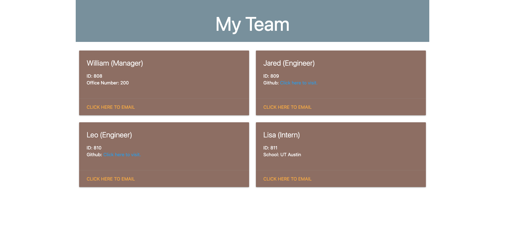

# :star: Team-Roster :star:

## Table of Contents

* [Description](#description)
* [Video Walkthrough](#video-walkthrough)
* [Installation](#installation)
* [Usage Instructions](#usage-instructions)
* [Credits](#credits)

## Description

This application generates a HTML file based off of information received by the user in the terminal. A series of questions determine information about a team member that will be displayed on the page with specific details depending on the type of role. 

## Video Walkthrough

[Click here](www.google.com) to view a video walkthrough of the README Genie. 

## Screenshots

Here is an example of a generated HTML file after questions are answered:  

  

## Installation

`npm init`
  
`npm install inquirer`

<!-- `npm install jest` -->

## Usage instrutions

Run the following command in the root directory of your project. Answer the questions to generate a HTML file which will be saved under the "dist" folder:
  
`node index.js`